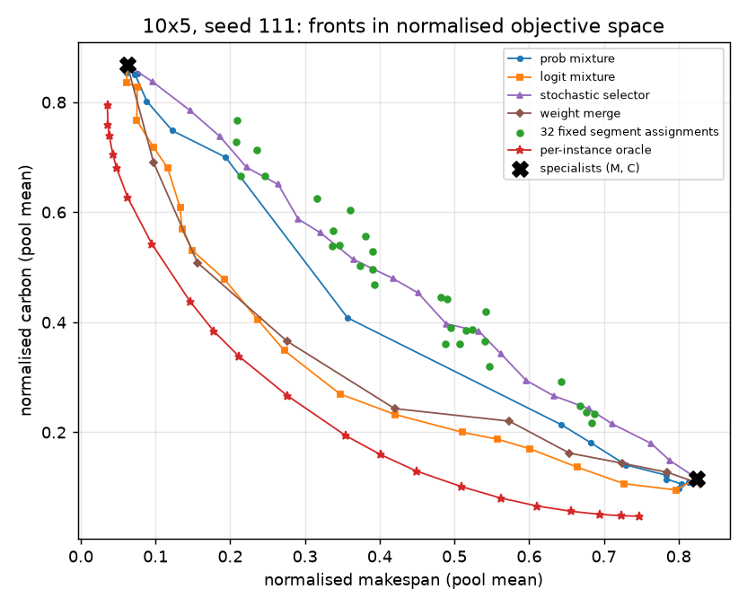
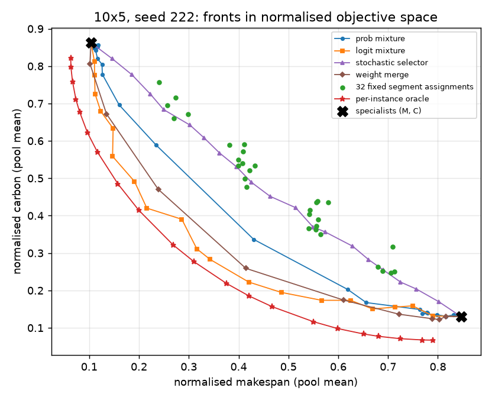
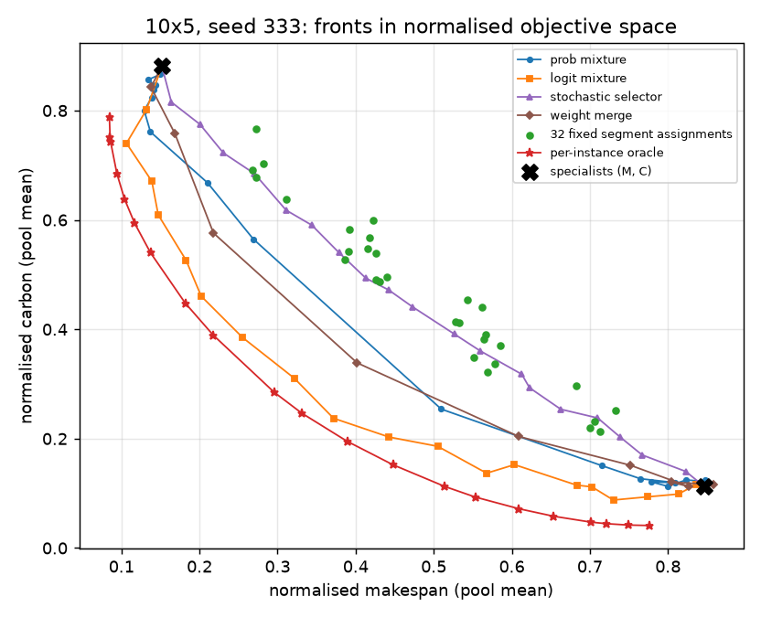
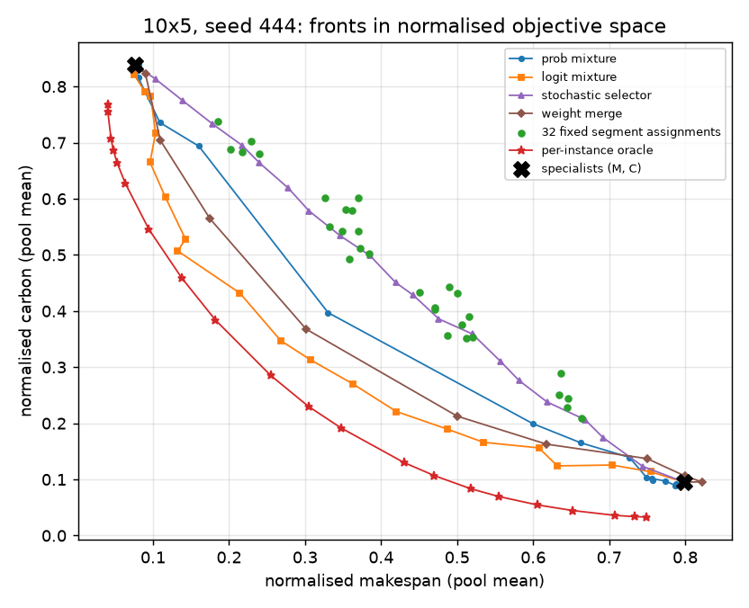

# RQ1 complementarity pilot -- can switching between frozen specialists beat fixed combinations?

10x5, two objectives (makespan, carbon), the canonical makespan (M) and carbon (C) specialists at seeds
111/222/333/444, FROZEN. Evaluation only: no training, no new checkpoints; reserved final-test sets untouched.
Greedy decoding unless stated; the n = 100 evaluation pool (train_vali) and, for transfer, the 18-instance
validation split. Code: `tools/complementarity.py` (rollouts), `tools/analyze_complementarity.py` (analysis).
Raw output: `results/complementarity/analysis_output.txt`, `results/complementarity/complementarity_summary.json`.

## Verdict

**Against the rule fixed in advance: headroom YES, transfer NO** -- which the rule reads as "complementarity
exists but is seed-specific". **That reading is not supported by the controls, and I would not act on it.**

* The per-instance switching oracle beats the best baseline by 8.6-16.5% on average over w_c = 0.3-0.7, at
  4/4 seeds (6.9-14.3% against the stricter any-alpha baseline). The headroom criterion is met.
* But **no fixed switching schedule beats the baselines**: the best single segment assignment, even chosen
  in-sample on the evaluation pool, is 24-32% WORSE than the best baseline (the logit mixture). The transferred
  assignment is therefore also worse (-26% to -34%), and keeps a NEGATIVE share of the headroom at all four
  held-out seeds. The transfer criterion fails.
* **The oracle's headroom is a selection effect, not a switching effect.** Given the same per-instance freedom,
  fixed-weight blending wins: the per-instance best probability/logit mixture over the 21 weights beats the
  per-instance best of the 32 switching schedules by 31-45%, and the per-instance best of the ~10 matched
  baseline rollouts beats it by 5-12%. A switch beats the best fixed-weight blend on only 11-17% of instances.
* **What the pilot does show:** the specialists disagree often (different top choice at 53-58% of decisions,
  mostly early in the schedule), and SOFT per-step blending of their decisions (the logit mixture) is the best
  baseline at almost every preference and beats weight merging (hypervolume 0.85-0.89 vs 0.75-0.85). Hard
  switching between whole experts, by schedule stage or at random, is clearly worse than soft blending.

**Bottom line for RQ1:** there is complementarity, but it is exploited by blending the two distributions at
every step, not by switching between specialists. The precondition for a router that SELECTS experts
state-dependently is not met here. A router that outputs a state-dependent SOFT weight has not been tested; a
cheap next pilot would be a segment-wise soft-alpha oracle (the same 5 segments, a weight from the 21-value
grid in each), which asks whether varying the blend weight during the schedule beats the best fixed weight.

---

## Fixed choices (stated before the analysis)

* **Normalisation.** Per instance, each objective min-max normalised by the ideal (min) and nadir (max) observed
  across BOTH specialists and ALL 4 seeds on that instance (separately on the evaluation pool and on the
  validation split). Score = w_m * norm_makespan + w_c * norm_carbon, lower is better; w_c in {0, 0.05, ..., 1}.
* **Hypervolume** in normalised space, reference point **(1.1, 1.1)**, on pool-mean points of each method.
* **Best baseline** at w: the best Step 1 method run at that preference (alpha = w; weight merge only where a
  lambda = w checkpoint exists, i.e. w_c in {0, 0.1, ..., 1}). A stricter "any alpha" variant is also reported.
* **Oracle:** per instance, the best of the 32 segment assignments at w.
* **Transfer "clearly positive share"** (the rule left this open; fixed before computing): a positive mean share
  of the oracle headroom over w_c 0.3-0.7 at >= 3 of 4 held-out seeds AND a mean share across held-out seeds >= 20%.
* **Masked / zero probabilities.** The network's logits are -inf on invalid pairs; log-probabilities are
  log_softmax of those, so every valid pair has a finite log-probability. The logit mixture is formed over valid
  pairs only (invalid entries set to -inf explicitly, never 0 x -inf) and renormalised with log_softmax; at
  w = 0 or 1 it is exactly one specialist. The probability mixture is 0 on invalid pairs by construction.
* **Batching.** The environment normalises processing times by the maximum over the whole batch, so naively
  batching 100 instances changed 3/100 decisions relative to the canonical one-at-a-time evaluation. Instances
  are batched in groups sharing the same maximum (4 groups); this reproduces the canonical evaluations exactly
  (0/100 instances differ, checked for both specialists at two seeds).

**Cost.** 896 batched rollouts (224 per seed; each up to 100 instances x 50 decisions) in **35.7 GPU-minutes**
on one RTX 5060 Ti. The switching oracle is 64 of the 224 per seed (32 on the pool, 32 on validation).

---

## Step 0 -- specialists' critics

The checkpoints DO include critic weights (the critic MLP is part of the saved state dict). Correlation of the
critic's value estimate with the realised return-to-go (gamma = 1, each specialist's own reward, greedy rollouts):

| seed | critic | r, pooled over all states | r, initial state vs episode return (across instances) | mean r within each step |
|---|---|---|---|---|
| 111 | M / C | +0.84 / +0.96 | +0.08 / +0.14 | +0.27 / +0.08 |
| 222 | M / C | +0.82 / +0.96 | -0.01 / -0.02 | +0.27 / +0.10 |
| 333 | M / C | +0.82 / +0.96 | +0.08 / +0.10 | +0.32 / +0.14 |
| 444 | M / C | +0.84 / +0.96 | +0.14 / +0.05 | +0.32 / +0.12 |

The high pooled correlation is almost entirely schedule progress (return-to-go shrinks as the schedule fills).
Across instances at the same step the critics carry little signal (r = 0.08-0.32), and they barely rank which
instances will end better (r = -0.02 to +0.14). Framing implication: the critics are not usable as per-state
value oracles for a router without further work.

---

## Step 1 -- baselines (score per preference, mean over seeds; lower is better)

| w_c | M spec | C spec | prob mixture | logit mixture | stochastic selector | weight merge | **best baseline** | per-instance oracle | best fixed assignment |
|---|---|---|---|---|---|---|---|---|---|
| 0.00 | 0.099 | 0.829 | 0.099 | 0.099 | 0.099 | 0.099 | 0.099 | 0.056 | 0.099 |
| 0.10 | 0.175 | 0.757 | 0.173 | 0.164 | 0.229 | 0.175 | 0.159 | 0.127 | 0.175 |
| 0.20 | 0.251 | 0.686 | 0.247 | 0.230 | 0.329 | 0.246 | 0.230 | 0.190 | 0.251 |
| 0.30 | 0.328 | 0.614 | 0.316 | **0.272** | 0.398 | 0.307 | 0.272 | 0.243 | 0.328 |
| 0.40 | 0.404 | 0.543 | 0.375 | **0.300** | 0.435 | 0.352 | 0.300 | 0.274 | 0.402 |
| 0.50 | 0.481 | 0.471 | 0.378 | **0.316** | 0.450 | 0.388 | 0.316 | 0.280 | 0.434 |
| 0.60 | 0.557 | 0.400 | 0.373 | **0.305** | 0.437 | 0.367 | 0.305 | 0.264 | 0.400 |
| 0.70 | 0.633 | 0.328 | 0.317 | **0.287** | 0.393 | 0.322 | 0.287 | 0.229 | 0.328 |
| 0.80 | 0.710 | 0.257 | 0.252 | 0.243 | 0.330 | 0.255 | 0.237 | 0.179 | 0.257 |
| 0.90 | 0.786 | 0.185 | 0.184 | 0.185 | 0.238 | 0.184 | 0.174 | 0.117 | 0.185 |
| 1.00 | 0.862 | 0.114 | 0.114 | 0.114 | 0.114 | 0.114 | 0.114 | 0.047 | 0.114 |

All 21 preferences and per-seed values: `analysis_output.txt`. The logit mixture is the best baseline at every
preference from 0.25 to 0.75. The stochastic selector (the naive preference-proportional router) is the worst
combination method at every preference, and worse than the better of the two specialists alone at every
preference from 0.3 to 0.7 except 0.5.

**Hypervolume** (reference 1.1, 1.1; normalised space):

| seed | specialists | prob mix | **logit mix** | stochastic selector | weight merge | all baselines | 32 fixed assignments | per-instance oracle |
|---|---|---|---|---|---|---|---|---|
| 111 | 0.448 | 0.753 | **0.881** | 0.739 | 0.847 | 0.883 | 0.730 | 0.976 |
| 222 | 0.423 | 0.750 | **0.850** | 0.701 | 0.802 | 0.855 | 0.681 | 0.927 |
| 333 | 0.403 | 0.733 | **0.871** | 0.698 | 0.749 | 0.871 | 0.675 | 0.934 |
| 444 | 0.492 | 0.779 | **0.887** | 0.762 | 0.826 | 0.890 | 0.743 | 0.983 |

The 32 fixed switching assignments have a SMALLER hypervolume than the probability mixture. Pareto plots, one per
seed:  
 

---

## Step 2 -- disagreement diagnostics (pooled over seeds and instances; 5 stages of 10 decisions)

| states visited by | measure | overall | stage 1 | 2 | 3 | 4 | 5 |
|---|---|---|---|---|---|---|---|
| M specialist | top choices differ | 0.58 | 0.74 | 0.63 | 0.61 | 0.57 | 0.36 |
| M specialist | JSD (bits) | 0.50 | 0.66 | 0.53 | 0.53 | 0.49 | 0.31 |
| M specialist | top-3 overlap | 0.82 | 0.58 | 0.84 | 0.84 | 0.87 | 0.96 |
| C specialist | top choices differ | 0.53 | 0.72 | 0.58 | 0.55 | 0.47 | 0.32 |
| C specialist | JSD (bits) | 0.46 | 0.64 | 0.50 | 0.47 | 0.40 | 0.28 |
| 0.5 prob mixture | top choices differ | 0.57 | 0.73 | 0.60 | 0.60 | 0.56 | 0.35 |
| 0.5 prob mixture | JSD (bits) | 0.49 | 0.65 | 0.52 | 0.52 | 0.48 | 0.29 |
| all | entropy M / C (bits) | 0.28-0.37 / 0.30-0.31 | 0.49-0.64 | | | | 0.14-0.19 |
| all | valid pairs per decision | 4.0-4.5 | 9.3-9.7 | 3.2-3.6 | 3.0-3.6 | 2.6-3.3 | 2.0-2.1 |

**Plainly: the specialists mostly DISAGREE on the top choice** (53-58% of decisions), while both are confident
(entropy about 0.3 bits). Disagreement is highest at the start of the schedule (72-74% at stage 1, JSD
0.64-0.66 bits) and lowest at the end (32-36%). Top-3 overlap is high after stage 1, but there are only 2-4
valid pairs per decision there, so it is nearly trivial.

---

## Step 3 -- switching oracle (K = 5 segments, 32 assignments per instance per seed)

**a) Oracle headroom vs the best baseline** (%, positive = oracle better), per preference and seed:

| seed | 0.0 | 0.1 | 0.2 | 0.3 | 0.4 | 0.5 | 0.6 | 0.7 | 0.8 | 0.9 | 1.0 | **mean 0.3-0.7** | vs any-alpha baseline |
|---|---|---|---|---|---|---|---|---|---|---|---|---|---|
| 111 | +42.8 | +22.9 | +20.8 | +16.8 | +13.7 | +15.4 | +14.8 | +23.7 | +28.7 | +31.6 | +59.2 | **+16.5** | +14.3 |
| 222 | +39.3 | +21.1 | +14.6 | +6.6 | +4.0 | +6.4 | +7.3 | +15.4 | +22.5 | +31.5 | +48.5 | **+8.6** | +6.9 |
| 333 | +44.3 | +10.6 | +12.0 | +7.7 | +9.7 | +10.6 | +12.5 | +19.0 | +18.0 | +34.1 | +63.5 | **+11.9** | +7.6 |
| 444 | +47.4 | +27.4 | +22.5 | +12.3 | +6.9 | +13.1 | +18.6 | +23.3 | +29.0 | +35.1 | +65.2 | **+14.8** | +13.0 |

Headroom is largest at the extreme preferences, where "the best of 32 rollouts" includes near-copies of the
right specialist that happen to do better on a given instance -- a hint that this is selection, confirmed below.

**b) Hypervolume:** per-instance oracle front 0.93-0.98 vs the best baseline front (logit mixture) 0.85-0.89 and
all baselines together 0.85-0.89. The 32 FIXED assignments as a front: 0.68-0.74, below every mixture.

**c) Structure.** Winners are spread thinly and ties are rare (1.04 winning assignments per instance):

| w_c | most common per-instance winners (share of instance x seed pairs) | best fixed assignment per seed (111/222/333/444) |
|---|---|---|
| 0.3 | MMMMM 20.5%, MCMMM 10.2%, MMCMM 7.7%, CMMMM 6.2%, MMMMC 6.0% | MMMMM / MMMMM / MMMMM / MMMMM |
| 0.5 | CCMCM 5.5%, CCMMM 5.2%, CCMCC 5.2%, MCCCM 5.0%, CCCMM 5.0% | CCMCM / CMCMM / CCMCM / CCMCM |
| 0.7 | CCCCC 16.8%, CCMCC 11.5%, CMCCC 9.2%, CCCMC 8.5%, CCCCM 7.0% | CCCCC / CCCCC / CCCCC / CCCCC |

The best FIXED assignment is consistent across seeds (at 0.5: "carbon early" CCMCM at 3/4 seeds), but it is
also useless: at 0.3 and 0.7 it is just the specialist, and at 0.5 it scores 0.434 against the logit mixture's
0.316. There IS a consistent structure; it just is not a good one.

**d) Transfer** (best fixed assignment per preference chosen on the other three seeds' VALIDATION results,
applied to the held-out seed's evaluation pool):

| held-out seed | picks at w_c 0.3 / 0.5 / 0.7 | vs best baseline, mean 0.3-0.7 | share of oracle headroom kept |
|---|---|---|---|
| 111 | MMMMM / CCMMM / CCCCC | -26.1% | -1.67 |
| 222 | MMMMM / CCMMC / CCCCC | -33.9% | -4.75 |
| 333 | MMMMM / CCMCM / CCCCC | -32.3% | -3.30 |
| 444 | MMMMM / CCMMM / CCCCC | -26.5% | -2.16 |

The picks transfer consistently, but no fixed assignment beats the best baseline even in-sample (-24% to -32%),
so the share kept is negative everywhere. The transfer criterion (positive share at >= 3/4 seeds, mean >= 20%)
fails at 4/4 seeds.

**e) Does the oracle's advantage come from STATE-DEPENDENT switching?** No, not on this evidence.

| seed | instances whose best of 32 is a switch (not MMMMM/CCCCC) | instances where a switch beats every matched baseline on that instance | best fixed SWITCH vs best any-alpha baseline | per-instance oracle vs per-instance best FIXED-ALPHA mixture (42 candidates) | per-instance oracle vs per-instance best of matched baselines |
|---|---|---|---|---|---|
| 111 | 90% | 51% | -33.0% | **-33.1%** | -5.0% |
| 222 | 91% | 43% | -41.5% | **-43.3%** | -12.1% |
| 333 | 94% | 47% | -41.8% | **-44.9%** | -9.3% |
| 444 | 88% | 48% | -34.9% | **-30.7%** | -6.1% |

(means over w_c 0.3-0.7; a switch beats the per-instance best fixed-alpha blend on only 11-17% of instances.)

Per instance, the best of 32 rollouts is usually a switch -- unsurprising, since 30 of the 32 are switches. But
when fixed-alpha blending is given the same per-instance choice, it beats switching by 31-45%. So the 8.6-16.5%
headroom does not show that different states need different experts. It shows that choosing the best of many
rollouts per instance beats any single fixed method, and blends make better candidates than switches.

---

## What this means for RQ1-RQ3

* **RQ1:** the specialists are complementary in the sense that blending their decisions at every step (logit
  mixture) beats either specialist and beats weight merging. They are NOT complementary in the sense RQ1 tests:
  switching between whole experts by schedule stage never beats a fixed blend, even with per-instance choice.
* **For the router:** an expert-SELECTING router (hard switching, or sampling an expert) starts from a dominated
  family. If a router is built, it should output a soft, state-dependent blend weight (alpha_t in [0, 1] applied
  to the logit mixture), and its baseline to beat is the fixed-alpha logit mixture (hypervolume 0.85-0.89).
* **Suggested next pilot (not run):** a segment-wise SOFT-alpha oracle -- per segment, a weight from the 21-value
  grid applied to the logit mixture -- to test whether varying the blend weight during the schedule beats the
  best fixed weight, with the same per-instance selection control and cross-seed transfer as here.
