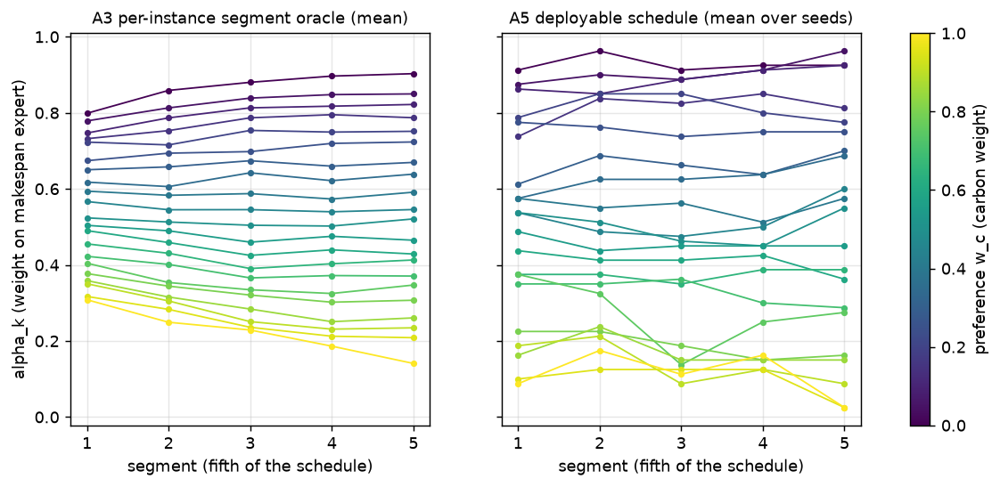

# Soft-weight segment oracle -- does changing the blend weight during a schedule beat the best fixed weight?

## Pre-registration

Written and committed BEFORE any experiment in this study was run. Not edited after results exist; later
changes go under "Deviations".

### Question
Is there value in a time- or state-dependent blend weight alpha_k over the schedule, beyond the best fixed
alpha? If not, a learned router alpha_t = g(s_t, w, pi_M, pi_C) has nothing to learn and the static logit
mixture is the answer.

### Setup (identical to the complementarity pilot, commit 8f51f80)
* 10x5 only; two frozen experts, the canonical makespan (M) and carbon (C) specialists; seeds 111/222/333/444,
  each seed using its own pair.
* Instances: the pilot's evaluation pool (the 100 train_vali instances). The reserved final-test sets are
  never loaded, evaluated or inspected.
* Preferences: w_c in {0, 0.05, ..., 1} (21 values), w_m = 1 - w_c.
* Normalisation and score exactly as in the pilot: per instance, each objective min-max normalised by the
  ideal and nadir observed across BOTH specialists and ALL 4 seeds on that instance (pool). Score =
  w_m * norm_makespan + w_c * norm_carbon, LOWER is better. Hypervolume reference point (1.1, 1.1),
  computed on pool-mean normalised points.
* Segments: 5 equal segments of the 50 decisions (steps 0-9, 10-19, 20-29, 30-39, 40-49).
* Greedy deterministic evaluation.
* Batching: only instances sharing the same maximum processing time are batched together (4 groups).
* Logit mixture: log p = alpha * log p_M + (1 - alpha) * log p_C over valid actions, renormalised
  (log_softmax); alpha is the weight on the MAKESPAN expert. The pilot parametrised the same family by the
  carbon weight w_c-mix = 1 - alpha; the arithmetic is kept identical to the pilot's, so fixed-alpha runs
  must reproduce the pilot's logit-mixture results exactly (checked before any arm is reported).

### Split
The 100 instances are split 50/50 into FIT and HELD-OUT with RNG seed 20260926, stratified by
maximum-processing-time group (within each group, half after a seeded shuffle; odd groups give the extra
instance to FIT). Instance IDs (file names) are recorded in `results/segment_oracle/split.json`.

### Arms (logit mixture throughout; G21 = {0, 0.05, ..., 1}, G101 = {0, 0.01, ..., 1})
* **A1** Best fixed alpha per (instance, w) from G21. The fair oracle control.
* **A2** Best fixed alpha per (instance, w) from G101. Matched-budget fixed control: more tries for the fixed
  arm, to separate "more tries" from "time-varying helps".
* **A3** Segment oracle per (instance, w): alpha_k per segment from G21, by coordinate descent. Start from A1's
  alpha; sweep segments 1 -> 5, try all 21 values for the current segment holding the others, keep the best
  (strict improvement only; ties keep the current value). Repeat passes until a full pass improves nothing or
  4 passes are done. Two restarts, from alpha = w_m (the matched mixture) and from a random schedule (seeded),
  keep the best. Evaluations used per (instance, w) are logged. Per-instance schedules are supported inside a
  batch.
* **A4** Deployable fixed alpha*: one alpha per (w, seed) from G21, chosen on FIT to minimise the mean score,
  evaluated on HELD-OUT.
* **A5** Deployable segment schedule: one 5-segment schedule per (w, seed), chosen on FIT by the same
  coordinate descent on the mean FIT score (start from A4's alpha*, same restarts), evaluated on HELD-OUT.
* **A6** Cross-seed transfer: the A5 schedule fitted on seed s applied to the specialists of seed s' != s,
  compared with seed s''s own A4 on HELD-OUT; all 12 ordered pairs.

### Metrics
* Score per (instance, w, seed), lower is better.
* HV across w per seed for A1 and A3 (all 100 instances, and on HELD-OUT) and for A4 and A5 (HELD-OUT).
* Per-instance headroom (A2 - A3) / A2 per (instance, w, seed). Operational definition: the mean over all
  (instance, w, seed) triples with A2 >= 0.02; triples with A2 < 0.02 (near the ideal point, where a relative
  gain is undefined or explosive) are excluded and their count reported. The ratio-of-means version
  (mean A2 - mean A3) / mean A2 is reported alongside. Also: % of (instance, w, seed) where A3 beats A2 by
  more than 0.5%.
* Deployable gain (A4 - A5) / A4 on HELD-OUT, as a ratio of means over held-out instances and all 21
  preferences: (mean A4 - mean A5) / mean A4. Paired bootstrap 95% CI resampling held-out INSTANCES (all
  preferences of an instance move together), 10,000 resamples, seed 20260926; per seed, and pooled (the same
  resampled instances applied to all four seeds). The mid-preference range w_c 0.3-0.7 is reported alongside.
* A6 gain vs the target seed's A4, the same way, per ordered pair and pooled.
* Schedule shape: mean alpha_k by segment for A3 (over instances and seeds) and A5 (over seeds), per w.
* Also: whether A2 closes most of the A3 - A1 gap (share = (A1 - A2) / (A1 - A3) on means).

### State-dependence check (uses A3 outputs only)
Target: the per-(instance, w, seed) A3 alpha_k. Features, measured at the start of segment k along the A3
rollout of that (instance, w, seed): expert top-choice disagreement rate and mean entropies of both experts
over the previous segment (segment 1: the first decision only); fraction of operations scheduled; remaining
work ratio (unscheduled mean-processing-time work / total); partial makespan relative to its initial lower
bound; partial carbon relative to the minimum-carbon cost of the operations scheduled so far; and w. No critic
values. Ridge regression (standardised features, penalty 1.0), 5-fold cross-validated R^2, per segment and
pooled; permutation null of 200 target shuffles, 95th percentile reported.

Operational definition for the decision rule (fixed now, because w alone determines most of alpha): the R^2
that counts is the one for the WITHIN-PREFERENCE part of alpha_k -- the target minus its mean over instances at
the same (w, seed), i.e. the part a fixed per-preference schedule cannot capture -- with the permutation null
shuffling targets within (w, seed) strata. The R^2 on the raw target with w included is reported as specified,
but it is not used for the decision.

### Decision rule
* **Outcome A** (time-varying blend helps and transfers): A5 beats A4 on HELD-OUT with a bootstrap CI above 0
  AND a mean gain >= 2%, in at least 3 of 4 seeds, AND A3 beats A2 by >= 3% mean per-instance.
  -> A learned router is justified; A5's fixed time schedule becomes an extra baseline the router must beat.
* **Outcome B** (headroom exists but only per instance): A3 beats A2 by >= 3%, but A5 fails the transfer
  criterion. -> Any value must come from state, not time. Proceed to a router only if the state-dependence
  R^2 beats the permutation-null 95th percentile in at least 2 segments; otherwise treat as Outcome C.
* **Outcome C** (no useful headroom): A3 beats A2 by < 3%. -> The static logit mixture is the answer; do not
  build a router.
* Also reported: whether A2 closes most of the A3 - A1 gap. If it does, the apparent gain was extra search,
  not time-variation.

### Cost rule
Estimate GPU time from the measured rollout cost before running; if over 6 GPU-hours, reduce the A3 restarts
to 1 and passes to 3 and log that as a deviation. Record actual GPU-minutes.

## Deviations

1. **Cost rule applied (decided before any arm ran).** Measured throughput levelled off at 1.9 ms per
   environment-rollout at large batch sizes; the full specification's upper bound was about 8.4 GPU-hours
   (A3 84 min + A5 42 min per seed), over the 6-hour limit. As pre-registered, A3 was reduced to ONE restart
   (the alpha = w_m restart was kept; the random restart was dropped) and 3 passes. A5 uses the same reduced
   search, since it is specified as "the same coordinate descent".
2. **Cross-validation grouped by instance.** The state-dependence regression uses 5-fold CV with all rows of an
   instance (all 21 preferences) in the same fold. Plain row-wise folds would let an instance's own features
   leak between training and test folds. This is stricter than "5-fold cross-validated R^2" as written.
3. **Execution.** (a) The first launch was stopped after about 2 minutes and restarted with a per-sweep log
   heartbeat, because a full pass (~7 min) could have tripped the 7-minute hang guard; nothing was lost.
   (b) Importing the pilot module replaces the command-line arguments, so the per-seed driver's first
   invocation ran all four seeds in one process. The per-seed commits therefore happened together at the end
   (commits 2382ad4, d8bc88f, d550f91, dd6df46) rather than after each seed, and A6 was skipped; it was run
   separately after the fix (commit after 0f9605d). Results are unaffected: every seed ran exactly once.
4. **Reproduction check passed.** Before any arm, all 21 fixed-alpha runs on G21 reproduced the pilot's logit
   mixture exactly (0 differing values), at all four seeds.

**Actual cost:** 176.4 GPU-minutes for A1-A5 (all seeds), 0.9 min for A6, about 3 min of smoke tests and the
aborted first launch: about **3.0 GPU-hours** in total.

**Remarks on reading the numbers.** Normalised scores can be NEGATIVE: blends can beat both specialists'
per-instance ideal values, which are the normalisation's zero. Relative gains therefore explode near the
extreme preferences (w_c near 0 or 1), where scores approach 0; the mid-preference rows are the ones to read.
Hypervolumes above 1.21 (= 1.1 x 1.1) occur for the same reason.

## Results

### Per-instance headroom: segment oracle A3 vs matched-budget fixed control A2

* Primary (pre-registered): mean over (instance, w, seed) of (A2 - A3)/A2, excluding A2 < 0.02 (1551 of 8400 triples excluded): **+47.09%**
* Ratio of means (mean A2 - mean A3)/mean A2: +46.22%
* Share of (instance, w, seed) where A3 beats A2 by more than 0.5%: 67.7%
* Share of the A1 -> A3 gap closed by A2 (G101 instead of G21, fixed): **23%**

| w_c | A1 fixed, G21 | A2 fixed, G101 | A3 segment oracle | headroom (A2-A3)/A2, per-instance mean | A3 beats A2 by >0.5% |
|---|---|---|---|---|---|
| 0.00 | 0.0016 | -0.0130 | -0.0529 | +104.00% | 26% |
| 0.05 | 0.0370 | 0.0228 | -0.0180 | +78.84% | 51% |
| 0.10 | 0.0708 | 0.0567 | 0.0177 | +53.62% | 61% |
| 0.15 | 0.1023 | 0.0885 | 0.0482 | +41.94% | 67% |
| 0.20 | 0.1305 | 0.1164 | 0.0783 | +35.11% | 72% |
| 0.25 | 0.1551 | 0.1406 | 0.1026 | +28.60% | 76% |
| 0.30 | 0.1761 | 0.1610 | 0.1212 | +25.30% | 74% |
| 0.35 | 0.1931 | 0.1774 | 0.1343 | +23.88% | 82% |
| 0.40 | 0.2047 | 0.1888 | 0.1433 | +25.53% | 78% |
| 0.45 | 0.2108 | 0.1949 | 0.1482 | +23.99% | 82% |
| 0.50 | 0.2118 | 0.1954 | 0.1457 | +27.51% | 80% |
| 0.55 | 0.2083 | 0.1912 | 0.1400 | +31.03% | 83% |
| 0.60 | 0.2003 | 0.1826 | 0.1300 | +33.62% | 80% |
| 0.65 | 0.1872 | 0.1698 | 0.1118 | +36.99% | 80% |
| 0.70 | 0.1702 | 0.1531 | 0.0922 | +39.91% | 77% |
| 0.75 | 0.1485 | 0.1321 | 0.0687 | +45.72% | 75% |
| 0.80 | 0.1227 | 0.1071 | 0.0403 | +60.90% | 72% |
| 0.85 | 0.0934 | 0.0784 | 0.0081 | +73.79% | 68% |
| 0.90 | 0.0616 | 0.0466 | -0.0223 | +90.88% | 59% |
| 0.95 | 0.0281 | 0.0128 | -0.0596 | +118.64% | 50% |
| 1.00 | -0.0070 | -0.0225 | -0.0974 | +164.30% | 30% |

Per seed (primary headroom): 111: +49.35%, 222: +44.40%, 333: +46.28%, 444: +48.39%

Evaluations used by A3 per (instance, w): median 422, mean 421, range 212-632 (A2 uses 101 fixed-alpha rollouts per instance, shared across w).

### Deployable gain on HELD-OUT: segment schedule A5 vs fixed alpha* A4, (A4 - A5)/A4

| seed | all 21 preferences: gain [95% CI] | w_c 0.3-0.7: gain [95% CI] | passes criterion (CI > 0 and gain >= 2%) |
|---|---|---|---|
| 111 | -1.30% [-5.88, +2.81] | -4.63% [-11.53, +1.56] | no |
| 222 | +1.10% [-4.20, +6.19] | +0.89% [-2.86, +4.23] | no |
| 333 | -3.67% [-8.77, +0.63] | -2.59% [-8.07, +2.32] | no |
| 444 | -1.60% [-6.46, +3.04] | -0.86% [-5.88, +4.46] | no |
| **pooled** | -1.32% [-4.09, +1.24] | -1.78% [-4.64, +0.68] | |

### Cross-seed transfer on HELD-OUT: seed s's A5 schedule on seed s''s specialists vs seed s''s own A4

| source -> target | all preferences: gain [95% CI] | w_c 0.3-0.7 |
|---|---|---|
| 111 -> 222 | +1.77% [-3.02, +6.41] | -1.11% |
| 111 -> 333 | -6.14% [-12.84, -0.19] | -6.69% |
| 111 -> 444 | -2.23% [-7.02, +2.29] | -0.13% |
| 222 -> 111 | -3.67% [-8.99, +1.79] | -2.07% |
| 222 -> 333 | -6.59% [-12.64, -0.95] | -3.82% |
| 222 -> 444 | -6.47% [-13.07, -0.02] | -4.94% |
| 333 -> 111 | -8.40% [-14.87, -2.10] | -11.41% |
| 333 -> 222 | -2.64% [-8.73, +2.72] | -5.93% |
| 333 -> 444 | -4.35% [-11.22, +2.48] | -6.07% |
| 444 -> 111 | -2.17% [-8.01, +3.64] | -0.02% |
| 444 -> 222 | -0.93% [-6.16, +4.01] | -4.38% |
| 444 -> 333 | -12.90% [-19.78, -6.72] | -9.12% |
| **pooled (12 pairs)** | -4.48% [-7.18, -1.90] | |

### Hypervolume across preferences (reference (1.1, 1.1), normalised pool-mean points)

| seed | A1 (all 100) | A3 (all 100) | A1 (held-out) | A3 (held-out) | A4 (held-out) | A5 (held-out) |
|---|---|---|---|---|---|---|
| 111 | 1.0934 | 1.2506 | 1.1216 | 1.2792 | 0.8581 | 0.8708 |
| 222 | 1.0759 | 1.2267 | 1.0835 | 1.2580 | 0.8226 | 0.8479 |
| 333 | 1.0791 | 1.2428 | 1.1067 | 1.2708 | 0.8361 | 0.8667 |
| 444 | 1.0957 | 1.2565 | 1.1113 | 1.2790 | 0.8659 | 0.8787 |

### Schedule shape: mean alpha_k (weight on the MAKESPAN expert) by segment

| w_c | A3 seg 1..5 | A3 first - last | A5 seg 1..5 | A5 first - last |
|---|---|---|---|---|
| 0.00 | 0.80 0.86 0.88 0.90 0.90 | -0.10 | 0.91 0.96 0.91 0.92 0.93 | -0.01 |
| 0.05 | 0.78 0.81 0.84 0.85 0.85 | -0.07 | 0.88 0.90 0.89 0.91 0.96 | -0.09 |
| 0.10 | 0.75 0.79 0.81 0.82 0.82 | -0.08 | 0.86 0.85 0.89 0.91 0.93 | -0.06 |
| 0.15 | 0.73 0.75 0.79 0.80 0.79 | -0.06 | 0.74 0.84 0.83 0.85 0.81 | -0.08 |
| 0.20 | 0.72 0.72 0.75 0.75 0.75 | -0.03 | 0.79 0.85 0.85 0.80 0.78 | +0.01 |
| 0.25 | 0.67 0.69 0.70 0.72 0.72 | -0.05 | 0.78 0.76 0.74 0.75 0.75 | +0.02 |
| 0.30 | 0.65 0.66 0.67 0.66 0.67 | -0.02 | 0.61 0.69 0.66 0.64 0.70 | -0.09 |
| 0.35 | 0.62 0.61 0.64 0.62 0.64 | -0.02 | 0.57 0.62 0.62 0.64 0.69 | -0.11 |
| 0.40 | 0.59 0.58 0.59 0.57 0.59 | +0.00 | 0.57 0.55 0.56 0.51 0.57 | +0.00 |
| 0.45 | 0.57 0.55 0.55 0.54 0.55 | +0.02 | 0.54 0.49 0.48 0.50 0.60 | -0.06 |
| 0.50 | 0.52 0.51 0.50 0.50 0.52 | +0.00 | 0.54 0.51 0.46 0.45 0.55 | -0.01 |
| 0.55 | 0.50 0.49 0.46 0.48 0.46 | +0.04 | 0.49 0.44 0.45 0.45 0.45 | +0.04 |
| 0.60 | 0.49 0.46 0.43 0.44 0.43 | +0.06 | 0.44 0.41 0.41 0.43 0.36 | +0.07 |
| 0.65 | 0.46 0.43 0.39 0.40 0.41 | +0.04 | 0.38 0.38 0.35 0.39 0.39 | -0.01 |
| 0.70 | 0.42 0.40 0.37 0.37 0.37 | +0.05 | 0.35 0.35 0.36 0.30 0.29 | +0.06 |
| 0.75 | 0.40 0.35 0.33 0.32 0.35 | +0.06 | 0.38 0.33 0.14 0.25 0.28 | +0.10 |
| 0.80 | 0.38 0.34 0.32 0.30 0.31 | +0.07 | 0.23 0.22 0.19 0.15 0.16 | +0.06 |
| 0.85 | 0.36 0.32 0.28 0.25 0.26 | +0.10 | 0.16 0.24 0.15 0.15 0.15 | +0.01 |
| 0.90 | 0.35 0.31 0.25 0.23 0.23 | +0.12 | 0.19 0.21 0.09 0.12 0.09 | +0.10 |
| 0.95 | 0.32 0.28 0.24 0.21 0.21 | +0.11 | 0.10 0.13 0.13 0.12 0.02 | +0.08 |
| 1.00 | 0.31 0.25 0.23 0.19 0.14 | +0.17 | 0.09 0.18 0.11 0.16 0.02 | +0.06 |

A3, first minus last segment alpha: mean +0.020; share of (instance, w, seed) with more makespan weight early 0.33, later 0.30, equal 0.37. A5 (w_c 0.3-0.7): first minus last per seed +0.01, -0.02, +0.11, -0.15.

### State-dependence check: predicting the A3 alpha_k from cheap state features (ridge, 5-fold CV grouped by instance)

Features: disagreement rate and both entropies over the previous segment, fraction scheduled, remaining-work ratio, partial makespan / initial lower bound, partial carbon / minimum-carbon cost so far, w. No critic values.

| segment | R^2, raw alpha_k (w included; reported, not decisive) | null 95th pct | R^2, WITHIN-preference alpha_k (decisive) | null 95th pct | beats null |
|---|---|---|---|---|---|
| 1 | 0.319 | -0.000 | 0.003 | -0.000 | yes |
| 2 | 0.405 | -0.000 | -0.005 | -0.000 | no |
| 3 | 0.515 | -0.000 | 0.003 | -0.000 | yes |
| 4 | 0.564 | -0.000 | -0.000 | -0.000 | yes |
| 5 | 0.559 | -0.000 | 0.004 | -0.000 | yes |
| pooled | 0.473 | -0.000 | 0.003 | -0.000 | yes |

### Verdict inputs

* A3 vs A2 per-instance headroom: +47.09% (threshold 3%) -> met
* Seeds where A5 beats A4 on HELD-OUT with CI > 0 and gain >= 2%: 0/4 (need 3) -> NOT met
* Segments where within-preference R^2 beats the null: 4/5 (need 2 for Outcome B -> router)
* A2 closes 23% of the A1 -> A3 gap
* **Outcome: B -> router (state)**

**How budget-matched is A2 really?** Not very. Fixed-alpha rollouts saturate: per instance, the 21 G21 values
give a median of **17 distinct schedules** and the 101 G101 values a median of **28**, whereas A3 evaluates a
median of **422** candidate schedules per (instance, w). A fixed weight cannot use a larger budget, so part of
A3's per-instance headroom is simply having far more distinct rollouts to pick from. A2 closes only 23% of the
A1 -> A3 gap, but that is a statement about how few distinct outcomes a fixed weight can produce, not proof
that time variation is what helps. The deployable and transfer tests below are the ones that separate the two.

## Verdict

**By the pre-registered rule: Outcome B -> router (state).**
* A3 beats A2 per instance by **+47.1%** (primary; mid preferences w_c 0.3-0.7: +24 to +40%) -> the >= 3%
  headroom criterion is met at all four seeds (+44.4% to +49.4%).
* A5 beats A4 on HELD-OUT at **0 of 4 seeds** (gains -3.7% to +1.1%, every CI spanning 0; pooled -1.3%
  [-4.1, +1.2]) -> the transfer criterion fails, so the outcome is B, not A.
* Within-preference state-dependence R^2 beats the permutation null at **4 of 5 segments** (need 2) -> B
  continues to "router".

**My reading, which differs from the rule's label, stated plainly.** The state signal that decides this is
**R^2 ~ 0.003**: the cheap state features explain about 0.3% of the within-preference variation in the per-instance
optimal alpha_k. It beats the null only because 8,400 rows make even a negligible effect detectable; the
pre-registered rule has no effect-size floor. Taken with the other results:
* a time schedule chosen on FIT does not beat a fixed weight on HELD-OUT (pooled -1.3%);
* a schedule transferred between seeds is WORSE than the target seed's own fixed weight (pooled -4.5%, CI
  [-7.2, -1.9], significantly below 0);
* the per-instance optimal schedules show no consistent shape (first-minus-last alpha +0.02 on average; 33%
  of cases put more makespan weight early, 30% later, 37% equal);
* the per-instance headroom is at least partly a matter of 422 candidate rollouts versus about 28 distinct
  ones.

The evidence therefore says the large per-instance headroom is instance-specific selection that neither
schedule-stage nor cheap state features capture. I would not treat this as justification for building a
router. If a decision needs a direct test, the cheapest one is to deploy the fitted ridge model's predicted
alpha_k on HELD-OUT instances and measure the score against A4. That asks whether the 0.3% signal buys any
score, rather than whether it is detectable.

## Summary for a non-specialist

We have two frozen scheduling policies, one that minimises completion time and one that minimises carbon, and
we already knew that blending their decisions at a fixed ratio works better than either alone. This study
asked whether changing that ratio as the schedule unfolds -- for example leaning on the makespan policy early
and the carbon policy late -- does better still. If we are allowed to tune the ratio separately for every
single problem instance with hindsight, it does, by a large margin (roughly 25% at balanced preferences).
But when we choose a ratio schedule on one half of the instances and test it on the other half, it is no better
than a fixed ratio, and a schedule tuned for one pair of policies is worse when applied to another pair.
Simple descriptions of the scheduling state explain almost none of which ratio is best (about 0.3% of the
variation). The hindsight gains are real but specific to each instance, and nothing we measured predicts them
in advance. For building a router, this means there is no learnable time or state pattern here worth a model:
the static blended policy is the practical answer unless a direct test shows the tiny state signal buys
measurable score.
